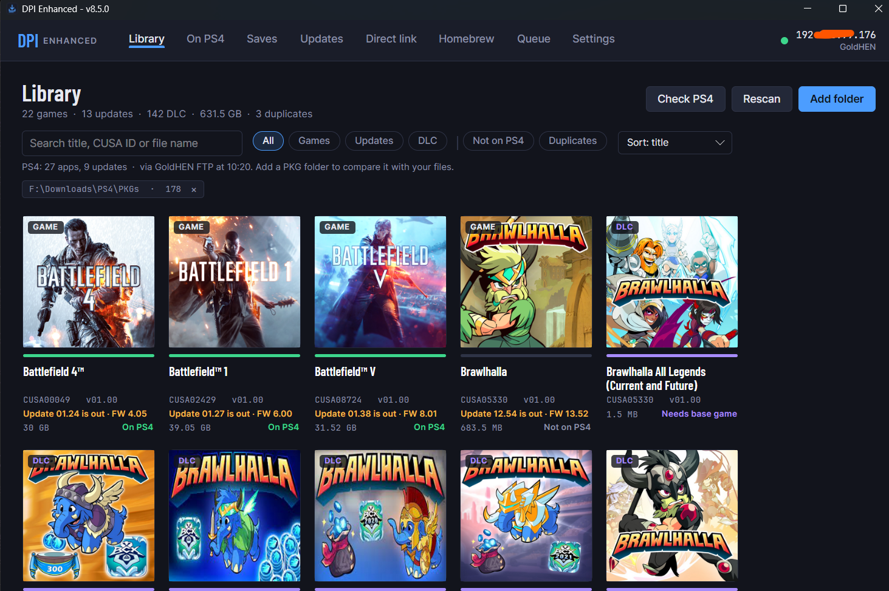
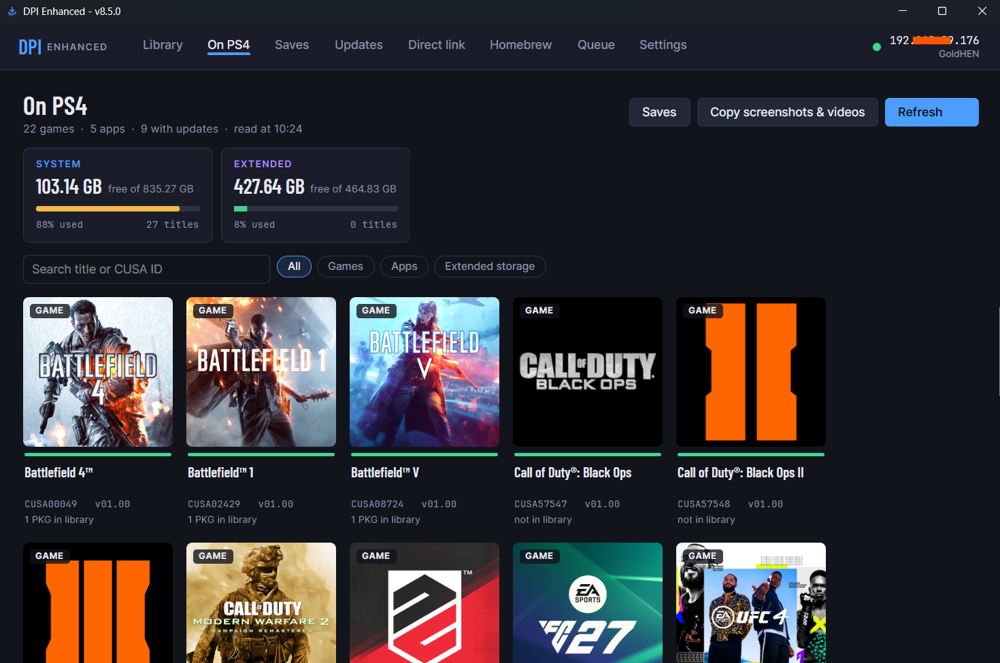
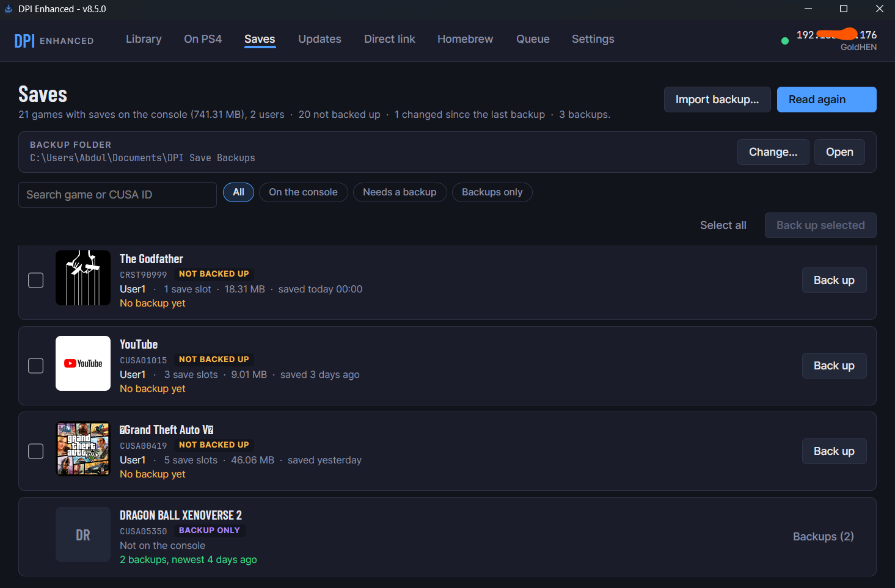
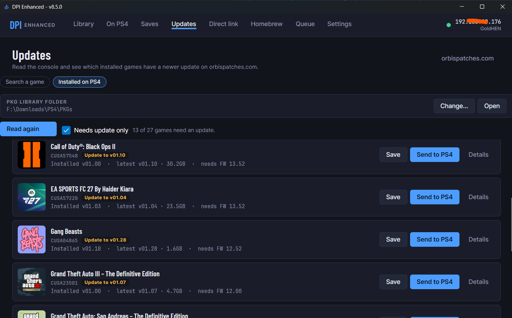
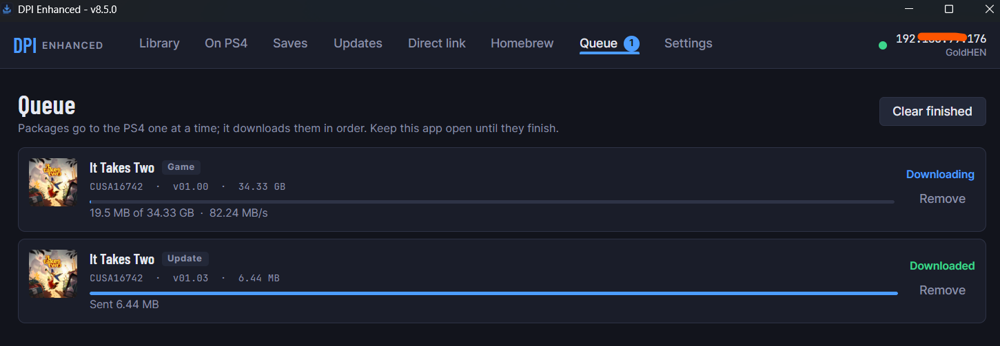

<div align="center">



# DPI Enhanced

**A PS4 package manager for Windows and Android.**

Keep your `.pkg` files in a cover‑grid library, see what's already on the console, send packages, move games between system and extended storage, back up saves, download official updates and copy screenshots — all from your PC or phone.

[](https://github.com/ReSo7200/DirectPackageInstaller-Enhanced/releases/latest)
[](https://github.com/ReSo7200/DirectPackageInstaller-Enhanced/releases)
[](LICENSE)
[](#)

**[Download the latest release →](https://github.com/ReSo7200/DirectPackageInstaller-Enhanced/releases/latest)** &nbsp;·&nbsp;
[Getting started](#getting-started) &nbsp;·&nbsp;
[Screenshots](#screenshots) &nbsp;·&nbsp;
[Features](#features) &nbsp;·&nbsp;
[Build](#build)

</div>

> [!NOTE]
> **Console requirements** — a jailbroken PS4 with [GoldHEN](https://github.com/GoldHEN/GoldHEN): its **BinLoader** to send packages and its **FTP server** (with full‑file‑system access) to read what's installed. [Remote Package Installer](https://github.com/flatz/ps4_remote_pkg_installer) is optional (uninstalling, moving games, live progress). etaHEN is supported for PS5.

---

## Overview

DPI Enhanced is a fork of [marcussacana/DirectPackageInstaller](https://github.com/marcussacana/DirectPackageInstaller), rebuilt around a new design and a workflow that treats your PKG library, the console and your saves as one thing. Sending from a direct download link still works exactly as it did in the original — that README is preserved further below.

### At a glance

|                     | Vanilla DPI                       | DPI Enhanced                                                                       |
| ------------------- | --------------------------------- | ---------------------------------------------------------------------------------- |
| Direct link install | ✅                                | ✅ (identical flow)                                                                |
| Local PKG library   | —                                 | ✅ Cover grid across folders, with what's on the console shown on each cover       |
| Installed on PS4    | —                                 | ✅ Games, apps, DLC, updates, running title, free space per drive                  |
| Save data           | —                                 | ✅ Every save on the console (all users), back up, restore, import                 |
| Official updates    | —                                 | ✅ Search or check installed, from orbispatches.com; save to library, send to PS4  |
| Send queue          | Single package                    | ✅ Resumable queue, split‑package support, *Send what's missing*, live progress    |
| Storage             | —                                 | ✅ Move games between system and extended storage from the PC                      |
| Homebrew            | —                                 | ✅ Apps from authors' GitHub releases; nothing re‑hosted                           |
| Explorer integration| —                                 | ✅ *Send to PS4* right‑click; drag and drop                                        |
| Mobile              | —                                 | ✅ Android build, phone‑sized layout                                               |

### Keyboard shortcuts (desktop)

<kbd>Ctrl</kbd>+<kbd>1</kbd> Library&nbsp;·&nbsp;
<kbd>Ctrl</kbd>+<kbd>2</kbd> On PS4&nbsp;·&nbsp;
<kbd>Ctrl</kbd>+<kbd>3</kbd> Direct link&nbsp;·&nbsp;
<kbd>Ctrl</kbd>+<kbd>4</kbd> Queue&nbsp;·&nbsp;
<kbd>Ctrl</kbd>+<kbd>5</kbd> Settings&nbsp;·&nbsp;
<kbd>Ctrl</kbd>+<kbd>6</kbd> Homebrew&nbsp;·&nbsp;
<kbd>Ctrl</kbd>+<kbd>7</kbd> Saves&nbsp;·&nbsp;
<kbd>Ctrl</kbd>+<kbd>8</kbd> Updates

---

## Screenshots

<table>
  <tr>
    <td width="50%" valign="top">
      <a href="docs/screenshots/library.png"></a>
      <p><b>Library</b> — every game, update and DLC across your PKG folders, with what's on the console shown on each cover.</p>
    </td>
    <td width="50%" valign="top">
      <a href="docs/screenshots/on-ps4.png"></a>
      <p><b>On PS4</b> — everything installed, with free space on system and extended storage.</p>
    </td>
  </tr>
  <tr>
    <td width="50%" valign="top">
      <a href="docs/screenshots/saves.png"></a>
      <p><b>Saves</b> — every save on the console for every user, next to your backups.</p>
    </td>
    <td width="50%" valign="top">
      <a href="docs/screenshots/updates.png"></a>
      <p><b>Updates</b> — installed games with a newer official update from orbispatches.com. Save into your library or send to the console.</p>
    </td>
  </tr>
  <tr>
    <td colspan="2" valign="top" align="center">
      <a href="docs/screenshots/queue.png"></a>
      <p><b>Queue</b> — packages go to the PS4 one at a time, with resumable transfers and live progress.</p>
    </td>
  </tr>
</table>

---

## Features

### Library
- **Your PKG folders as a cover grid:** local, USB or network folders, scanned (subfolders too) into games, updates and DLC grouped by title, with search, filters and sorting. Folders on a disconnected drive show as offline.
- **What's already on the PS4:** one click, or automatically at startup. Each cover's bar shows it: green on the console, amber stripes when an update is missing, blue while sending. *Not on PS4* and *Duplicates* filters.
- **Newer official updates:** titles whose newest local update is behind Sony's latest are marked ("Update 03.49 is out · FW 13.52"), and the update can be downloaded from Sony next to your files.
- **Send what's missing:** the game if it isn't installed, the newest update if it's newer than the console's, and DLC that isn't there yet.
- **Check a package for damage** before sending it: the checksums inside the PKG are recomputed, and a broken download is named in plain words.
- **BACKPORT badges** on updates rebuilt for older firmware, **split packages** (`name_0.pkg`, `name_1.pkg`, …) sent as one, and **tidy-up**: clear file names, one folder per game, duplicates to the Recycle Bin / Trash.
- **Unlock-key DLC** (licence-only packages the console's downloader refuses) are copied to `/data/pkg` for GoldHEN's Package Installer, and show as installed afterwards.
- Windows **Explorer right-click menu**: *Send to PS4 (DPI)* on `.pkg` files, *Add to DPI library* on folders. Drag and drop works too.

### On PS4
- **Everything installed**, on system and extended storage, with covers, versions, updates and DLC, and what's running right now.
- **Storage boxes:** free space, total and usage for each drive (experimental payload).
- **Move between system and extended storage** (right-click). It runs on the console, the way Itemzflow restores apps: the installed packages are set aside on the same drive, the title is removed with Remote Package Installer, and the payload installs each package from that file onto the other drive. Nothing is sent from your PC, the copy set aside is only deleted after the console's own task finished, and a move interrupted by closing the app is found again and can be retried.
- **Game patches:** 60 FPS, resolution and other patches from the [PS-Game-Patch](https://github.com/illusionyy/PS-Game-Patch) database for the installed version. Switch them on, save, and they apply when the game starts (needs GoldHEN's Game Patch plugin).
- **Copy screenshots & videos** to `Pictures\DPI Captures`, a folder per game.
- **Uninstall** games, updates and DLC (Remote Package Installer).

### Saves
- **Every save on the console**, all games and all users, next to your backups: covers, users, save slots, size and when it was last saved. Each game says whether it's *backed up*, *not backed up* or *changed since* the last backup; search and filters (*Needs a backup*, *Backups only*).
- **Back up** one game or all you tick: a zip per user in a folder you choose (`Documents\DPI Save Backups` by default, `Download/DPI Save Backups` on Android), one folder per game with its cover.
- **Restore** a backup to its own user or another one on the console. What it overwrites is backed up first (kept as a *BEFORE RESTORE* backup), a running game is refused, and each file is checked after it's written. Saves are sealed to their console: another console's saves need resigning with Apollo Save Tool.
- **Import** save zips from elsewhere, and delete old backups (to the Recycle Bin / Trash).

### Updates
- **Search any PS4 game** on [orbispatches.com](https://orbispatches.com) by name or CUSA ID and see its full update history: version, size, required firmware and changelog.
- **Installed on PS4:** read the console, then look each installed game up on orbispatches to flag which are behind. *Needs update only* filter and a plain-English summary ("13 of 27 games need an update"). Refreshes automatically when the console is rescanned on another tab.
- **Save** downloads the latest update from PlayStation Network into your PKG library folder — next to the base game when it's there, else the folder you chose (`Change…` on the page). **Send to PS4** downloads it, then enqueues it to the console just like the Library's send.
- Older versions open on **orbispatches.com** so the browser can handle the site's reCAPTCHA gate for direct download.

### Sending and installing
- **Queue:** packages go out one at a time (game, then updates, then DLC) with live progress, pause/resume, retry and readable error messages. It says *Installed* when the console confirms it, and the Library and On PS4 update by themselves.
- **Install to** system or extended storage for each package (experimental payload): the console's Application Install Location setting is switched for that install and put back.
- **Direct link:** paste a URL or a path (quotes from Explorer's *Copy as path* are removed), preview the package, install. Archives, JSON manifests and debrid services work as in the original.
- Pop-ups tell you when sends and moves finish.

### Homebrew
- Free PS4 apps from their authors' GitHub releases: **Apollo Save Tool**, **ezRemote Client**, the **Homebrew Store** app and **GoldHEN Cheat Manager**, plus any GitHub project you add. *Download & send* puts the package in the Queue; nothing is re-hosted.

### Settings
- **Find consoles** on your networks (PS4 and PS5), and pick **this PC's address** from your network adapters (it never changes on its own).
- **Send a payload** (`.bin` / `.elf`) to GoldHEN's BinLoader.
- **Updates:** a dialog at startup when a newer version is out (can be switched off), and *Check now* in About.
- **About:** contributor and special-thanks cards with GitHub links.

### Android
The same pages under bottom tabs, sized for phones, with the app's own folder picker for your PKG folders.

Buttons are only enabled when they can do something, and their tooltip says why when they can't.

---

## Getting started

**On the PS4**

1. Boot GoldHEN and open **Debug Settings → GoldHEN Settings**.
2. Turn on **BinLoader Server** (sends packages) and **FTP Server** with **Full File-System Access** (reads what's installed and where saves live).
3. Optional but recommended: install [Remote Package Installer](https://github.com/flatz/ps4_remote_pkg_installer) — needed for **uninstall** and **live install progress**, and used by **move to extended storage**.

**On the PC**

1. [Download the latest release](https://github.com/ReSo7200/DirectPackageInstaller-Enhanced/releases/latest), unzip, run `DirectPackageInstaller.Desktop.exe`. Framework‑dependent builds need the [.NET 8 Desktop Runtime](https://dotnet.microsoft.com/download/dotnet/8.0); the *self‑contained* zips don't.
2. Open **Settings** → **Find consoles** (auto‑discovers PS4s on your network), or type the PS4's address. Confirm **This PC's address** is on the same network.
3. Go to **Library** → **Add folder** and pick where your `.pkg` files are (nested folders are scanned). Press **Check PS4**.
4. Select packages and press **Send to PS4**. Keep DPI open until the Queue says they're done.

> [!TIP]
> Turn on **Experimental GoldHEN payload** in Settings to unlock free‑space per drive, choose install target (system/extended) and the *Move between storage* action.

## App updates

DPI checks for new versions the way InstaEclipse does: it reads [`version.json`](version.json) on this repository's default branch:

```json
{ "latest_version": "8.6.0", "update_url": "https://github.com/ReSo7200/DirectPackageInstaller-Enhanced/releases/latest" }
```

To publish a version: raise `SelfUpdate.CurrentVersion` in the app, publish a GitHub release tagged `v8.6.0` with the builds attached (`Windows-X64.zip`, the `.apk`, …), then bump `latest_version`. Without `version.json`, the latest GitHub release is used.

## Build

**Windows**

```powershell
powershell -ExecutionPolicy Bypass -File build-windows.ps1            # Release\Windows-X64.zip
powershell -ExecutionPolicy Bypass -File build-windows.ps1 -Runtimes win-x64,win-arm64 -SelfContained
```

The script installs a .NET 8 SDK into `.dotnet\` if none is found. The GitHub workflow `.github/workflows/windows.yml` builds the same zips.

**Android** needs the .NET Android workload, the Android SDK and JDK 17:

```powershell
dotnet publish DirectPackageInstaller\DirectPackageInstaller.Android\DirectPackageInstaller.Android.csproj -c Release -f net8.0-android -p:AndroidSdkDirectory=<sdk> -p:JavaSdkDirectory=<jdk17>
```

**GoldHEN payload** (`Payload\`): build with `make` / `make experimental` on Linux (or WSL) from a Linux-side clone, since the Windows checkout breaks the header symlinks.

**Testing without a console:** [`Tools/FakePS4`](Tools/FakePS4) pretends to be a PS4 on localhost (FTP, Remote Package Installer and the payload) so moves can be tested end to end.

## Troubleshooting

<details>
<summary><b>The console pill stays red / "GoldHEN offline"</b></summary>

Make sure GoldHEN's **BinLoader** *and* **FTP server** are both switched on in **Debug Settings → GoldHEN Settings**. On some setups the FTP server needs **Full File‑System Access** enabled (same page). Double‑check the PS4's IP address in Settings.

</details>

<details>
<summary><b>"Read the console" reads nothing / a few titles missing</b></summary>

GoldHEN's FTP server sometimes drops the first connection or lacks read permission on `/system_data/priv/appmeta`. Toggle its **Full File-System Access** option, restart the FTP server, and press **Read again**. DPI retries automatically across a few ports (2121, 1337, 21).

</details>

<details>
<summary><b>Send fails "port 12800 refused" or "can't reach the console"</b></summary>

Open **Remote Package Installer** (or another PKG installer) on the console, so it's listening on port 12800. Some routers block PC → PS4 traffic; put both on the same LAN/subnet.

</details>

<details>
<summary><b>Windows Firewall blocks the sends</b></summary>

DPI hosts a small HTTP server for the console to pull packages from. On first send Windows may prompt to allow it. If you dismissed the prompt, allow `DirectPackageInstaller.Desktop.exe` through the firewall for **Private** networks.

</details>

<details>
<summary><b>Update installs but the console says the game "needs base"</b></summary>

Updates only install over a matching base game of the same version family. Send the base game first (or use the Library's *Send what's missing*).

</details>

<details>
<summary><b>Save restore says "the game is running"</b></summary>

Close the game on the console before restoring (or use the app's *Close game* if you have etaHEN). A running game holds its save files open and the restore would corrupt them.

</details>

## Credits

**Contributors:** [ReSo7200](https://github.com/ReSo7200) (DPI Enhanced), [marcussacana](https://github.com/marcussacana) (DirectPackageInstaller), [0xMH](https://github.com/0xMH), [ksanjeev284](https://github.com/ksanjeev284).

**Special thanks:** [flatz](https://github.com/flatz) (Remote Package Installer), [GoldHEN](https://github.com/GoldHEN), [LightningMods](https://github.com/LightningMods) (Itemzflow, Homebrew Store), [illusionyy](https://github.com/illusionyy) (PS-Game-Patch), [OpenOrbis](https://github.com/OpenOrbis) (LibOrbisPkg), [oct0xor](https://github.com/oct0xor) (PS4 registry research), [jpmikkers](https://github.com/jpmikkers) (DHCPServer), [AvaloniaUI](https://github.com/AvaloniaUI).

---

<details>
<summary><h2>📎 Original DirectPackageInstaller README (upstream)</h2></summary>

<br>

# DirectPackageInstaller

A tool to preview and send PKG files to your PS4 or PS5 using direct download links.  
This tool supports three different methods for sending PKGs:

-   Remote Package Installer Homebrew
-   GoldHEN Payload Server    
-   etaHEN DPIv2 API
    

Features
----------

-   Preview PKG files
-   Standalone PS4 package downloads
-   PS5 etaHEN support
-   Automatic proxying to speed up PS4 downloads
-   Support for RAR/7z compressed files
-   Resumable downloads (only for uncompressed files)
-   Segmented downloads
-   Support for several file hosting services
-   Support for PSN update manifests (split PKGs)
-   Works with or without Remote Package Installer
-   Command Line Interface (CLI)
-   JDownloader Click'n Load support
-   Auto LAN Cable Connection (Windows Only)
-   Can Install PKGs from NFS source
    

Supported File Hosting Services
----------

-   Any direct link (without authentication)
-   AllDebrid ([API key required](https://alldebrid.com/apikeys/))
-   RealDebrid ([API key required](https://real-debrid.com/apitoken))
-   DebridLink ([API key required](https://debrid-link.com/webapp/apikey))
-   Google Drive
-   Mediafire
-   PixelDrain
-   1Fichier (must wait 60 minutes after each download)
    

How to Install
----------

1. Grab the latest build for your platform from the **[DPI Enhanced releases page](https://github.com/ReSo7200/DirectPackageInstaller-Enhanced/releases/latest)** — Windows (x64/x86/ARM64) and Android (`.apk`) are published there.
2. Windows framework-dependent builds need the [.NET 8 Desktop Runtime](https://dotnet.microsoft.com/download/dotnet/8.0). Android installs the `.apk` directly (sideload — enable *Install unknown apps* for your file manager).

> The upstream `marcussacana/DirectPackageInstaller` builds (Linux, macOS, legacy Android arch zips) are not part of this fork and the links from the original README are not maintained here.

How to Use
----------

#### Direct Download Mode

1.  Launch Remote Package Installer or enable GoldHEN Payload Server.    
2.  Open DirectPackageInstaller.    
3.  Paste a direct PKG URL into the "PKG URL" field.    
4.  Click "Load" and wait.    
5.  Click "Install" and wait again.    
6.  Done! You can close the application or shut down your PC.    

#### Proxied Download Mode (for PS4s without internet access)

1.  Launch Remote Package Installer or enable GoldHEN Payload Server.    
2.  Open DirectPackageInstaller.    
3.  Go to `Options -> Proxy Downloads` and enable it.    
4.  Paste a direct PKG URL.    
5.  Click "Load", then "Install".    
6.  Wait for the installation to finish.
    

#### Segmented Download Mode (fastest)

1.  Make sure you have enough free disk space.
2.  Launch Remote Package Installer or enable GoldHEN Payload Server.
3.  Open DirectPackageInstaller.
4.  Go to `Options -> Segmented Downloads` and enable it.
5.  Paste a direct PKG URL.
6.  Click "Load", then "Install".
7.  The PKG will be downloaded and preloaded before installation.

> Note: In segmented mode, the PS4 cannot track download progress accurately.

#### Compressed File Mode (always proxied)
1.  Make sure you have enough free disk space.    
2.  Launch Remote Package Installer or enable GoldHEN Payload Server.    
3.  Paste the direct URL to your compressed file.    
4.  Click "Load" and wait.    
5.  [Optional] Select the desired PKG from the file list.    
6.  Click "Install" and wait.

NFS PKG Source
----------

To use an NFS server as a source for DPI, you just need to provide a URL in a format supported by DPI.
There are two supported NFS URL formats:

- `nfs://YOUR_NFS_IP_OR_HOSTNAME/ExportedPath/FilePath/FileName.pkg`

- `nfs://YOUR_NFS_IP_OR_HOSTNAME/FilePath/FileName.pkg`

In the first format, the path starts with the exact exported directory (as configured in the NFS server's /etc/exports).
DPI will mount that specific export and look for the file within it.

In the second format, no specific export path is provided. In this case, DPI will attempt to search across all available exports on the NFS server to locate the requested file.
Note that this may slow down the initial access if your server has many exports.

PS: The DPI is incompatible with the winnfsd due this bug [#88](https://github.com/winnfsd/winnfsd/issues/88), for windows, you can use [haneWIN NFS Server](https://www.hanewin.net/nfs-e.htm) instead.


How It Works
----------
DirectPackageInstaller is a simple tool that uses the Remote Package Installer's API to add PKG downloads directly to your PS4 or PS5. It helps you preview and send packages easily.

Additionally, the tool features an automatic proxy server to accelerate downloads. Since the PS4 has much better speeds over LAN than WAN, proxying through your PC can significantly improve performance.

It also works without the Remote Package Installer if you enable the binloader — the tool will automatically decide which method to use.

When using compressed files (RAR/7z), everything happens in parallel: download, extraction, and upload to your console. This saves time and disk space compared to traditional methods.

Segmented mode downloads PKGs in parallel threads to your PC, while sending them to the console. It's the fastest option, though it won't show progress on the PS4 screen.


Command Line Interface (CLI)
----------

An experimental CLI is available.

Note: RAR/7z and segmented downloads are not supported in CLI mode (yet).  
To view available options:

-   On Windows: `DirectPackageInstaller.Desktop.exe -help`    
-   On other systems: `DirectPackageInstaller.Desktop -help`
    


Dependencies
----------
Windows framework-dependent builds require the [.NET 8.0 Desktop Runtime](https://dotnet.microsoft.com/download/dotnet/8.0). Android `.apk` builds are self-contained.


How to Build
----------

1.  Install the .NET 8.x SDK.    
2.  Run the `Build.cmd` script (works on both Windows and Unix-like systems).    
3.  A `Release` directory with the compiled binaries will be created.    

For custom payloads, run `make` in the payload directory and replace the generated `payload.bin` inside `DirectPackageInstaller/DirectPackageInstaller/payload`.

Android builds:
----------
-   Targets API level 26    
-   Install Android SDK and NDK    
-   Accept SDK licenses    
-   Edit `Build.cmd` to set SDK/NDK paths    
-   Run `Build.cmd` as admin (first time only)

Alternatively, fork the project and use GitHub Actions for builds.

Q&A
----------

**My download is taking too long to start**  
You're probably downloading a multipart compressed file. The more volumes, the longer it takes to scan and validate. This isn’t a bug — just how compressed file access works. Please be patient.

**Download speed is slow, even in segmented mode**  
Segmented mode doesn't report accurate progress to the PS4. Use your PC's Task Manager to monitor real network usage.

**Segmented mode and only 2 Mbps?!**  
Some hosting sites (e.g., Zippyshare) are just slow. Try testing with Google Drive for better performance.

**Recommended file hostings?**

-   AllDebrid / RealDebrid    
-   Google Drive    
-   Mediafire
-   Everything else
-   1Fichier (slowest)
    

**I got an error during installation**  
Open an issue! Seriously, don’t worry — mistakes happen. If there's a crash, check the `DPI-Crash.log` for details.

Disclaimer
----------

This tool is for legitimate purposes only. It’s intended to help users install their personal backups. Piracy is not supported.  
You are responsible for how you use this software.

Warnings
----------

-   Avoid multiple parallel decompressions — process one file at a time.
-   Compressed file downloads create a temporary PKG cache, requiring free disk space equal to the final PKG size.

Credits
----------

-   **LibOrbisPkg** by _maxton_
-   **HttpServerLite** by _jchristn_
-   Payload template by _sleirsgoevy_
-   PS4 OS internals help by _LM_
-   PS4 export definitions by _OpenOrbis SDK_
-   **DirectPackageInstaller** by _marcussacana_

</details>
